# ⚔️ GitLevel

**Level up your GitHub profile.** GitLevel turns your GitHub activity into an
RPG-inspired **character card** — class, level, XP, fame, and combo streak —
rendered as an animated SVG you can embed in your README `` tag.

Traditional stats cards answer *"what have you done?"* GitLevel answers a more
fun question: **"who are you becoming as a developer?"**

Once one person deploys it, **anyone** can use that deployment — just embed an
`` URL with your username. No token, no config, nothing to install.

**https://gitlevel.vercel.app/**

## How does it look like


## Use it in your README

Paste this in and swap in your own GitHub username — that's the only change:

```md

```

Or with sizing and a theme:

```html

```

> Using your own deployment? Swap `gitlevel.vercel.app` for your domain — see
> [Deploy your own](#deploy-your-own-5-minutes).

## The class gallery

Your most-used language becomes your **class**, shown here at Legendary rank so
every crest wears its full regalia (emblem · rune ring · crown · 4 of 5 stars):

<table>
<tr>
<td>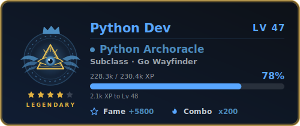</td>
<td>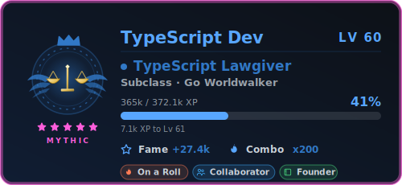</td>
</tr>
<tr>
<td>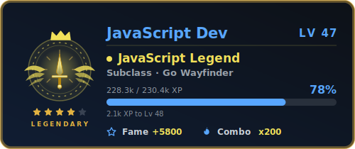</td>
<td>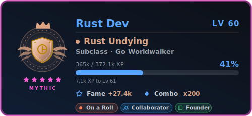</td>
</tr>
<tr>
<td>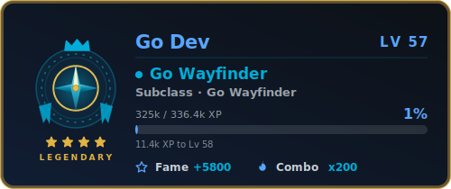</td>
<td>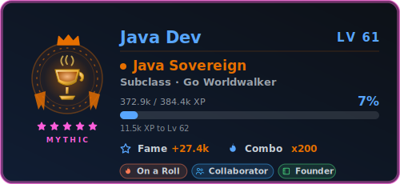</td>
</tr>
<tr>
<td>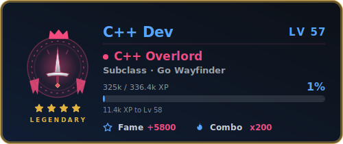</td>
<td>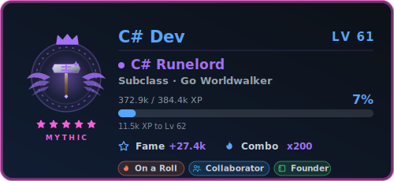</td>
</tr>
<tr>
<td>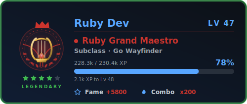</td>
<td>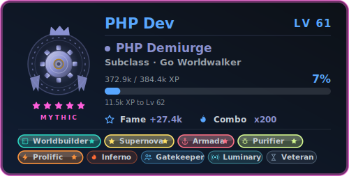</td>
</tr>
<tr>
<td>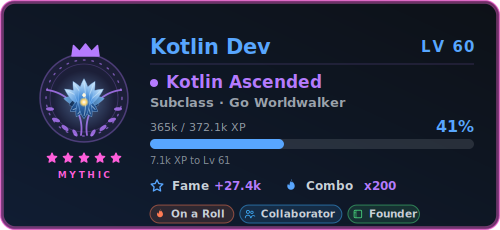</td>
<td>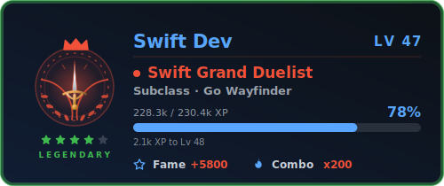</td>
</tr>
</table>

Any other language falls back to a generic path so every developer still gets a
crest.

## What's on the card

- **Class** — your most-used language becomes an RPG profession
  (Python → *Oracle*, Rust → *Sentinel*, C++ → *Warlord*, …), with a crest glyph.
- **Subclass** — your second language (e.g. *Python Oracle · C++ Warlord*).
- **Level & XP** — earned from **craft**: commits, merged PRs, closed issues, PR
  reviews, and repos, amplified by how long you've been on GitHub. Popularity is
  deliberately *not* here. Early levels come fast; the top tiers take real work.
  See [XP & Levelling](#xp--levelling).
- **Rarity tiers** — your title and frame evolve through five bands as you level
  (*Common → Rare → Epic → Legendary → **Mythic***), shown by the stars, the frame
  colour, and a crown at Legendary+.
- **Fame** — a separate axis of *reach*: followers + stars/10. Kept apart from XP
  on purpose, so a quiet high-level dev and a famous low-level dev read as
  genuinely different characters.
- **Combo** — your current contribution-streak in days.

A GitHub username is the **only** required input; everything else is inferred.

## XP & Levelling

XP measures **craft**, not popularity. Stars and followers never touch it — they
feed [Fame](#whats-on-the-card) instead, so the two stats stay orthogonal.

**1. Craft XP** — each contribution is worth a fixed number of points:

| Contribution        | XP  |
| ------------------- | --- |
| Repo created        | 120 |
| Merged pull request | 65  |
| Pull-request review | 40  |
| Closed issue        | 30  |
| Commit              | 10  |

**2. Tenure multiplier** — years on GitHub *amplify* craft rather than adding flat
XP, so a long-standing, genuinely productive dev is rewarded for the long haul
while an old but empty account still scores ≈ 0:

```
totalXP = craftXP × (1 + min(yearsOnGitHub, 15) × 0.05)      # up to +75%
```

**3. Level curve** — quadratic, so early levels come fast and each one costs a
little more than the last:

```
level      = floor( sqrt( totalXP / 100 ) )
XP to reach level L = 100 × L²
```

**Worked example** — a 4-year dev with 1,800 commits, 120 merged PRs, 60 closed
issues, 30 reviews, and 15 repos:

```
craftXP = 1800×10 + 120×65 + 30×40 + 60×30 + 15×120
        = 18000 + 7800 + 1200 + 1800 + 1800  = 30,600
totalXP = 30,600 × (1 + 4×0.05)  = 30,600 × 1.20 = 36,720
level   = floor( sqrt(36,720 / 100) ) = floor(19.16) = 19   →  Epic, 16% to Lv 20
```

**Rarity tiers** — level bands are front-loaded, so most active devs climb quickly
and **Mythic** stays a rare summit:

| Tier          | Levels  | Craft XP to reach¹ | Stars |
| ------------- | ------- | ------------------ | ----- |
| ⚪ Common      | 1 – 5   | 0                  | ★     |
| 🔵 Rare        | 6 – 14  | 3,600              | ★★    |
| 🟣 Epic        | 15 – 28 | 22,500             | ★★★   |
| 🟡 Legendary   | 29 – 54 | 84,100             | ★★★★  |
| 🔴 Mythic      | 55 +    | 302,500            | ★★★★★ |

¹ Before the tenure multiplier — a long-tenured dev reaches each tier with
proportionally less raw craft.

> The single source of truth for these numbers is `XP_WEIGHTS`, `BASE_XP`, and
> `TENURE` in [`src/engine.js`](src/engine.js); this table mirrors them.

## `GET /api/card` — the character card

`/api` is an alias for `/api/card`, so both URLs work.

| Param           | Type   | Default | Notes                                                   |
| --------------- | ------ | ------- | ------------------------------------------------------- |
| `username`      | string | —       | **required**                                            |
| `theme`         | enum   | `volt`  | see Themes below                                        |
| `hide_border`   | bool   | `false` |                                                         |
| `title_color`   | color  | theme   | hex without `#` (3/4/6/8) or CSS name                   |
| `text_color`    | color  | theme   |                                                         |
| `bg_color`      | color  | theme   | `00000000` = transparent, or a gradient `deg,c1,c2`     |
| `border_color`  | color  | theme   |                                                         |
| `glow_color`    | color  | theme   | drives the neon glow filter                             |
| `border_radius` | number | `14`    | clamped 0–60                                            |
| `card_width`    | int    | `500`   | clamped 440–800                                         |
| `cache_seconds` | int    | `86400` | clamped 3600–86400 (24h default)                        |
| `animation`     | bool   | `true`  | `false` renders a static card                           |
| `creator`       | bool   | `true`  | `false` shows a creator's real class instead of the sigil |
| `exclude_langs` | string | —       | comma-separated languages to ignore when picking your class (e.g. `HTML,CSS`) |

The card accent is tinted by your **class color** automatically; theme params
still control the surrounding chrome.

## Classes

Your primary language → class, promoted through five tiers by level (see
[XP & Levelling](#xp--levelling) for the level bands):

| Language   | Common     | Rare       | Epic        | Legendary        | Mythic      |
| ---------- | ---------- | ---------- | ----------- | ---------------- | ----------- |
| Python     | Adept      | Oracle     | Seer        | Archoracle       | Godseer     |
| TypeScript | Scribe     | Arbiter    | Justicar    | High Arbiter     | Lawgiver    |
| JavaScript | Wanderer   | Maverick   | Outrider    | Legend           | Mythmaker   |
| Rust       | Watchman   | Sentinel   | Guardian    | Eternal Guardian | Undying     |
| Go         | Explorer   | Pathfinder | Trailblazer | Wayfinder        | Worldwalker |
| Java       | Steward    | Chancellor | Magistrate  | Grand Chancellor | Sovereign   |
| C++        | Soldier    | Warlord    | Conqueror   | Overlord         | Warbringer  |
| C#         | Enchanter  | Spellsmith | Spellmaster | Archsmith        | Runelord    |
| Ruby       | Performer  | Virtuoso   | Maestro     | Grand Maestro    | Luminary    |
| PHP        | Tinkerer   | Artificer  | Inventor    | Master Artificer | Demiurge    |
| Kotlin     | Disciple   | Ascendant  | Exemplar    | Paragon          | Ascended    |
| Swift      | Fencer     | Duelist    | Champion    | Grand Duelist    | Blademaster |
| C          | Operator   | Machinist  | Systemwright| Kernel Lord      | Machine God |
| Zig        | Kindler    | Voltmage   | Tempest     | Stormlord        | Thunderking |
| Lua        | Moonling   | Lunar Adept| Moon Sage   | Selenarch        | Moonlord    |
| Verilog / VHDL | Drafter | Circuitwright | Logic Architect | Chip Lord   | Silicon Sovereign |
| Elixir     | Brewer     | Alchemist  | Potion Sage | Grand Alchemist  | Philosopher |
| Haskell    | Scholar    | Lambda Adept| Monadic Sage| Category Archon | The Pure    |
| Shell      | Scripter   | Shellbinder| Daemoncaller| Terminal Lord    | Root Sovereign |
| Dart       | Thrower    | Marksman   | Sharpshooter| Deadeye          | Truesight   |
| Scala      | Climber    | Ridgewright| Summit Sage | Peak Lord        | Skybreaker  |
| R          | Analyst    | Statmage   | Data Augur  | Grand Statistician | Numbermancer |
| SQL        | Clerk      | Archivist  | Query Weaver| Grand Archivist  | Data Warden |

Any other language falls back to a generic path (*Novice → Adept → Expert →
Master → Grandmaster*) so every developer still gets classed.

Your class comes from the language bytes aggregated across your **own, non-fork**
repos. If a data dump or vendored code skews it (e.g. a repo full of `HTML` or
`Jupyter Notebook` outweighing your real Python), drop those languages with
`exclude_langs`:

```md

```

## Themes

| name          | vibe                                                  |
| ------------- | ----------------------------------------------------- |
| `volt`        | electric GitHub-blue `#58a6ff` on deep navy (default) |
| `midnight`    | violet `#a371f7`                                      |
| `sunset`      | orange/red `#ff8f5a`                                  |
| `matrix`      | green `#39d353`                                       |
| `ice`         | cyan `#56d4dd`                                        |
| `transparent` | no background — blends into any README                |

<table>
<tr>
<td align="center"><code>volt</code><br/>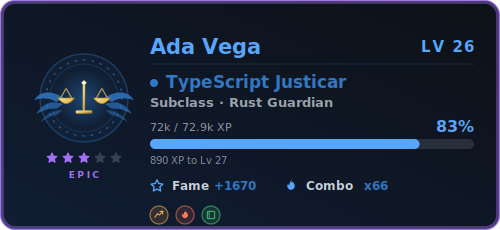</td>
<td align="center"><code>midnight</code><br/>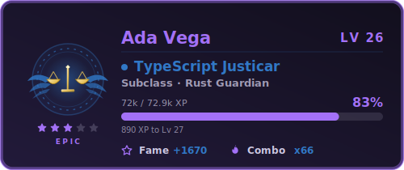</td>
</tr>
<tr>
<td align="center"><code>sunset</code><br/>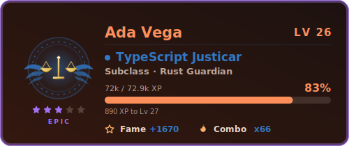</td>
<td align="center"><code>matrix</code><br/>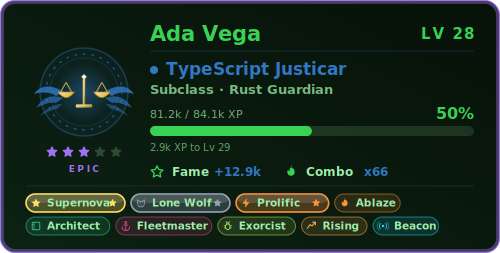</td>
</tr>
<tr>
<td align="center"><code>ice</code><br/>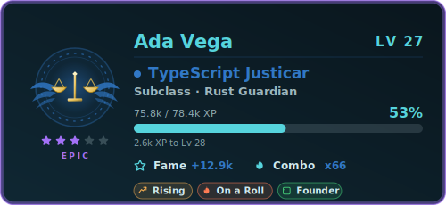</td>
<td align="center"><code>transparent</code><br/><em>no background — blends into any README</em></td>
</tr>
</table>

All motion runs once on load and settles (plus a soft glow pulse on the level),
and cards respect `prefers-reduced-motion`.

## Deploy your own (≈5 minutes)

1. **Fork or clone** this repo and push it (public).
2. **Create a GitHub token:** Settings → Developer settings → Personal access
   tokens → **Fine-grained**, no extra permissions (public read is enough). A
   classic PAT with no scopes also works.
3. **Import to Vercel:** [vercel.com](https://vercel.com) → Add New Project →
   import your repo. Zero config needed.
4. **Add the env var:** Project → Settings → Environment Variables →
   `GITHUB_TOKEN = <your token>`. Optionally add `PAT_1`, `PAT_2`, … for token
   rotation (a random one is used per request, spreading the rate-limit budget).
   Redeploy.
5. **Test:** open `https://your-deployment.vercel.app/api/card?username=YOUR_LOGIN`.

The token stays server-side and serves every viewer of your deployment.

**Optional env vars**

| Env var                 | Default  | Notes                                                        |
| ----------------------- | -------- | ------------------------------------------------------------ |
| `GITHUB_TOKEN`          | —        | required; public read is enough                              |
| `PAT_1`, `PAT_2`, …     | —        | extra tokens; one is picked at random per request            |
| `PROFILE_CACHE_TTL_MS`  | `600000` | in-memory per-user cache TTL (10 min) — see How it works     |

## Local preview (no token needed)

```bash
npm run preview
```

Renders GitLevel cards from mock profiles — every theme, class, and tier — into
`preview/*.svg` and a `preview/index.html` gallery. Open it in a browser to see
the animations. Live API calls need a token; use `vercel dev` with a `.env`
(see `.env.example`) to test the real endpoint.

The curated cards embedded in this README live in `examples/` (committed, unlike
`preview/`). Regenerate them after changing the crest art or themes:

```bash
npm run examples
```

## How it works

```
README  → GitHub Camo → /api/card (Vercel serverless, holds the token)
             → per-user cache → GitHub GraphQL → stat engine → animated SVG
             → Cache-Control headers so Camo/CDN absorb repeat views
```

- **Zero runtime dependencies** — `fetch` + template strings, nothing else.
- **Two caching layers.** The CDN (`Cache-Control`) caches each *rendered URL*.
  Behind it, a per-warm-instance cache keyed on **username alone** holds the raw
  GraphQL payload, so the same user in six themes is six CDN keys but **one** API
  call. Rendering params are applied after the cache, never multiplying requests.
- **Rate-limit budget** (`rateLimit { remaining resetAt }`) is logged on every
  live fetch, so quota pressure is diagnosable in the deployment logs.
- Errors never break the image slot: unknown user, rate limits, and bad tokens
  all render a small error SVG with HTTP 200.
- All query params are validated/escaped before touching SVG markup.

## Credits

- Param conventions inspired by
  [anuraghazra/github-readme-stats](https://github.com/anuraghazra/github-readme-stats) (MIT).
- Chrome icons adapted from [GitHub Octicons](https://github.com/primer/octicons) (MIT).

## License

[MIT](LICENSE)
